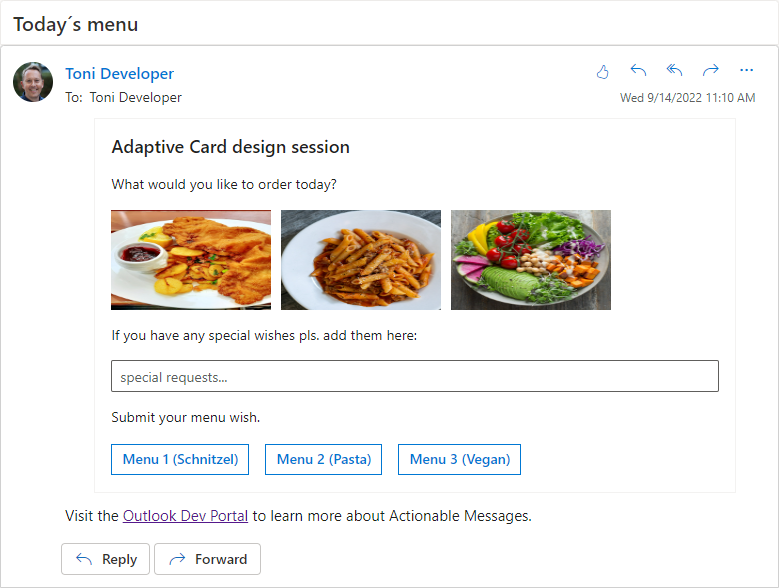
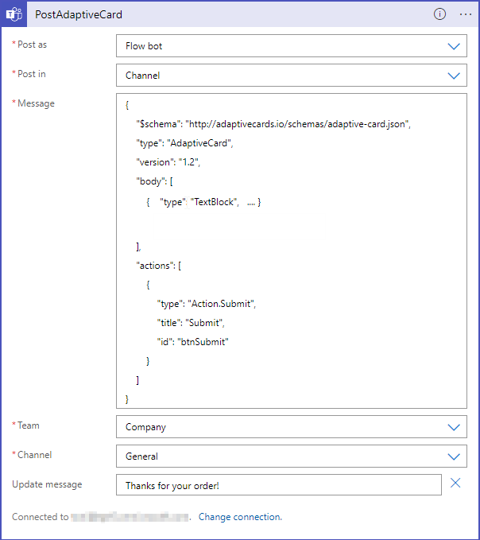

# MEC-Actionable Messages for Outlook

Outlook Actionable Messages is a simple and powerful declarative layout format with adaptive cards that offer a lot of flexibility and allow for visually rich cards. This repository includes samples for the session "Use Outlook Actionable Messages and Take Action in Outlook" held together with [@magrom](http://twitter.com/magrom) at [Microsoft Exchange Community Airlift](https://mecairlift.event.microsoft.com/ ) in September 2022. Also, thanks to [@cwilfing](http://twitter.com/cwilfing) for his support for sending via Graph and reacting.  

## Samples

The samples include some Azure Logic Apps, PowerShell scripts, a Postman collection, and adaptive card templates. The demo shows how to use actionable messages with Microsoft Outlook, Viva Connections, and in Teams. Feel free to download and to adapt the samples.

  

## Actionable messages

See more about Adaptive Cards at the following resources:

- The home: https://adaptivecards.io/ 
- Try it out:  https://messagecardplayground.azurewebsites.net/ 
- Requirements and supported clients: https://docs.microsoft.com/en-us/outlook/actionable-messages/#outlook-version-requirements-for-actionable-messages
- Send AC´s via email: https://docs.microsoft.com/en-us/outlook/actionable-messages/send-via-email 
- Code sample HelloActionableMessages: https://github.com/OfficeDev/HelloActionableMessages 

## Send via Microsoft Graph

The process to use actionable cards is as follows:  

- Use [sendmail graph action](https://docs.microsoft.com/en-us/graph/api/user-sendmail?view=graph-rest-1.0&tabs=http) to send a mail as user or shared mailbox
- Embed the html code and the actionable card json into the post body of the sendmail graph request
- Actionable card contains [Action.http](https://docs.microsoft.com/en-us/outlook/actionable-messages/adaptive-card#actionhttp) with a POST request to another logic app receiving the result
- Actionable Card post triggers 2nd logic app and receives HTTP 2xx result with body containing the updated Adaptive Card (just the JSON of the adaptive card, no html content or script tag!)


### Empty Graph Request Payload

```JSON
{
    "message": {
        "subject": "Approval",
        "body": {
            "contentType": "HTML",
            "content": "<HTMLContent>"
        },
        "toRecipients": [
            {
                "emailAddress": {
                    "address": "<some-emailAddress>"
                }
            }
        ]
    }
}
```

HTMLContent should contain the full HTML Body with the actionable Card like the following sample:

``` HTML
<html>
<head>
    <meta http-equiv="Content-Type" content="text/html; charset=utf-8">
    <script type="application/adaptivecard+json">## ACTIONABLE CARD JSON ##</script>
</head>
<body>
    Visit the <a href="https://docs.microsoft.com/outlook/actionable-messages">Outlook Dev Portal</a> to learn more
    about Actionable Messages.
</body>
</html>
```

The actionable card json is filled into the script tag. The type of the script tag defines if this will be an Actionable Card Current Version or Legacy. The body of the HTML mail is only shown if the actionable Card contains hideOriginalBody property (described [here](https://docs.microsoft.com/en-us/outlook/actionable-messages/adaptive-card))

What you need to do, for the graph request to work: 
- Replace the " with \" (to escape for the graph post body)
- ~~Replace \r and \n (Regex) with 'nothing' (reduce the whole html body to a single line)~~ seems this doesn't need to be done in the logic app
- Be carefull with postback to a logic app following headers are important to understand: 
  - Authorization / Value = '' => if you don't clear the authorization header in the action.http message the logic app receives the bearer from the initial request and returns http - 401 (access denied)
  - Content-Type / application/json => if you try to send json content back to your logic app the post body of the actionable card needs to be valid json. (which is usually not easy due to " escaping) if you send the json payload of the actionable card with ' not " .. this works Sample below. (this allows for json objects to be constructed and used in the answer for the second logic app)


``` JSON
{
    "type": "Input.Text",
    "id": "ApproveReason",
    "placeholder": "Add a reason",
    "isMultiline": true
},
{
    "type": "ActionSet",
    "actions": [
        {
            "type": "Action.Execute",
            "title": "Submit",
            "method": "POST",
            "url": "<postbackurl>",
            "body": "{'requestId':'{{ApproveReason.value}}'}",
            "headers": [
                {
                    "name": "Content-Type",
                    "value": "application/json"
                },
                {
                    "name": "Authorization",
                    "value": ""
                }
            ]
        }
    ]
}
```

### Headers in the return post to logic app

The answer to the:

CARD-UPDATE-IN-BODY: true
=> required as header in return if there is an update to the CARD

CARD-ACTION-STATUS: text
=> readable error message

See the samples.

## Send via Teams connector in a flow

There´s a ready-to-use connector for flows that posts an Adaptive Card and waits for the response.

  

See [3-send-teams.json](./Samples/3-send-teams.json).
